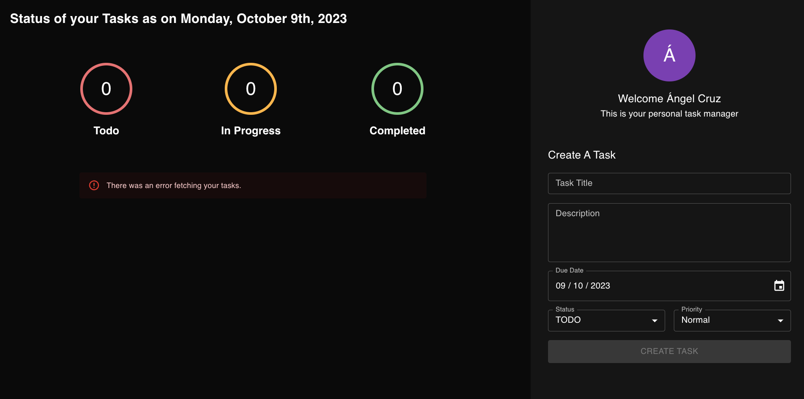
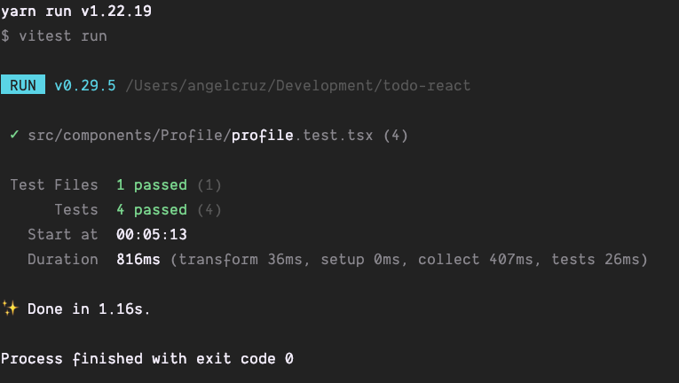

# TODO App - React

[](https://github.com/AngelCruzL/todo-react/actions/workflows/deploy.yml)

This is a simple TODO app built with React with TypeScript to practice the integration with React Query, Material UI and
Vitest.

## Features

- Create a TODO
- Update a TODO
- Fetch all TODO's
- Use React Query to change the state of the TODO's
- Custom styles with Material UI
- CI/CD with GitHub Actions
- Unit tests with Vitest

## Technologies

- React v18.2.0
- TypeScript v4.9.3
- Material UI v5.11.13
- React Query v4.29.1
- Vitest v0.29.5
- GitHub Actions

## What I learned?

- How to integrate React with TypeScript
- How to use React Query to fetch data from an API
- How to use React Query to change the state of the data
- How set up Vitest to test React components
- How to use Material UI to style React components
- How add custom styles to Material UI components

## Requirements

- [Node.js](https://nodejs.org/en/) v16.13.0 or higher
- [Yarn](https://yarnpkg.com/) v1.22.17 or higher

## Setup

1. Clone the repository

```bash
git clone git@github.com:AngelCruzL/todo-react.git
```

2. Install dependencies

```bash
yarn install
```

3. Create a `.env` file in the root directory with the content of the `.env.example` file or execute the following
   command and replace the values with your own

```bash
cp .env.example .env
```

4. Start the development server

```bash
yarn start
```

This will open the app in the browser at [http://localhost:3000](http://localhost:3000) and you will see the next error:



This is because the app is trying to fetch the TODO's from the API but the API is not running yet. To fix this error you
need to download the backend from this [repository](https://github.com/AngelCruzL/todo-nodeTs), after download it and
execute it, the app will be able to fetch the TODO's from the API.

## Tests

This project includes some basic tests (you can find more in another branch). To run the tests execute the following
command:

```bash
yarn test
```

This will execute the tests and show the next output:



## Deployment

You can find the automatic deploy managed by GitHub Actions in the next link:

[https://angelcruzl.github.io/todo-react/](https://angelcruzl.github.io/todo-react/)
